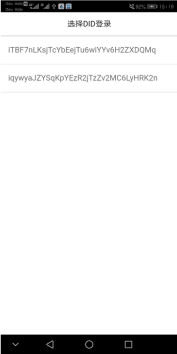

# 1.DID 介绍

* DID是区块链世界的身份标识，类似于现实世界的身份证

* Elastos DID在Wallet统一集成

## 2.调用 DID 登录说明

### 2.1.下载和安装 appmanager 插件

插件目录：

https://github.com/elastos/Elastos.ORG.Wallet.Mobile/tree/ds/appmanager

安装指令:

```
ionic cordova plugin add D:\project\Elastos.ORG.Wallet.Mobile\appmanager
```

### 2.2.在需要使用 DID 登录的 Page 里面加入如下的代码

```
declare let cordova: any;
cordova.plugins.appmanager.StartApp("wallet/www/index.html" +
"?type=did_login&message=this is did login message&backurl=game/www/index.html",
function (data) {},
function (error) {});
```


## 3.调用参数说明

```
cordova.plugins.appmanager.StartApp("wallet/www/index.html" +
"?type=did_login&message=this is did login message&backurl=game/www/index.html",
function (data) {},
function (error) {});
```

* “wallet/www/index.html”：目标的Dapp根路径，目前钱包的路径是wallet/www/index.html
* type: 登录类型，目前DID登录值为did_login
* message: 用于加密校验的消息
* backurl: 获取到did后返回的DApp的根路径

## 4.返回参数说明


* didNum: DID数字，32位的一个字符串
* sign: 对message签名后的结果
* didPubkey: 用户的公钥
* Message: Sign的输入参数
* Check_DID函数我们会直接输出,在应用的index.html 包括下面一行代码即可

  ```
  <script src="assets/checkDID.js"></script>
  ```

* checkDID.js的文件也在
https://github.com/elastos/Elastos.ORG.Wallet.Mobile/tree/ds/build

## 5.运行在 Trinity 内的效果


