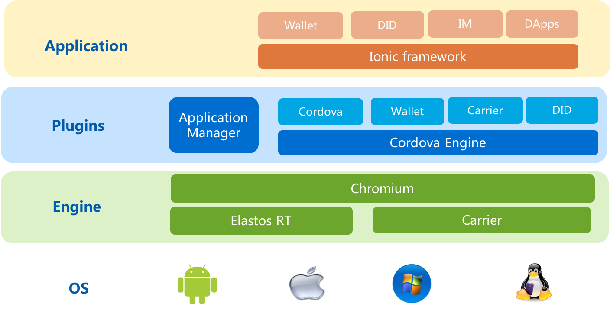
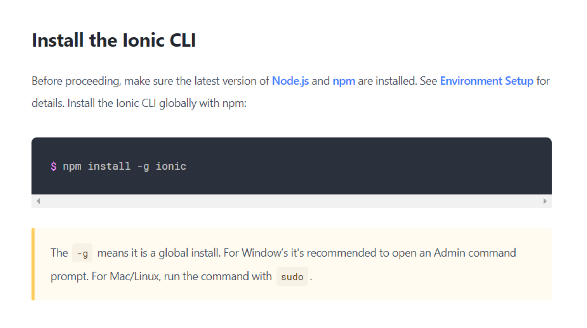
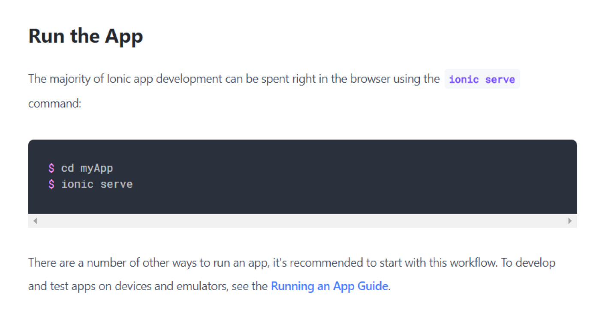

# 1.目录

* Introduction to Trinity
* Definition of DApp
* Setup Development Environment
* Create Dapp
* Run the Dapp
* 调试应用
* 内置插件

## 2.Trinity 介绍

* Trinity is a container that provides DApp running environment. Based on the trusted running environment of Elastos Runtime, Trinity provides a reliable running environment for applications to protect digital content 。
* Trinity为了便于应用开发者，采用兼容ionic开发框架来支持应用开发。应用开发者可用直接把基于ionic的输出目录下的文件来生成DApp的包. 同一个DApp可运行在Android, IOS, Windows, Linux等设备上。
* Ionic 是一个强大的 HTML5 应用程序开发框架(HTML5 Hybrid Mobile App Framework )。可以帮助您使用 Web 技术，比如 HTML、CSS 和 JavaScript 构建接近原生体验的移动应用程序。ionic 主要关注外观和体验，以及和你的应用程序的 UI 交互，特别适合用于基于 Hybird 模式的 HTML5 移动应用程序开发。
* Ionic是一个轻量的手机UI库，具有速度快，界面现代化、美观等特点。

### 2.1.Trinity 特点


### 2.2.Trinity 的优势

* DApp运行在用户的个人设备上，永远属于用户

* DApp运行不依赖中心服务器

* 数字产权登记在区块链上，去中介交易

* DApp可以由用户自由打包生成，自由创新

* 保护数字资产，产权不被泄露、破坏

### 2.3.Trinity Architecture



## 3.DApp 定义

DApp有两部分组成：DApp的所有权和DApp文件。

DApp的所有权登记在区块链上，就像比特币一样放在个人的钱包里，如果钱包里没有这个DApp的所有权的话，是无法运行它的。当然DApp作者可以设置免费模式。如果一个游戏DApp玩够了想转卖，可以像交易比特币一样去出售，当然这个交易必须使用支付，类似币币交换，可以是中心化的交换或者是去中心化的交换。DApp文件的分发方式可以是多种多样的，可以是在中心化网站，类似hao123，雅虎黄页，这样的推荐网站，或者是各种App Store，也可能是云盘，再或者是点对点发送文件。

## 4.环境搭建



## 5.创建应用


## 6.运行应用



### 6.1.运行在 Trinity 内

* 1 安装Trinity基座程序
* 2 调用Ionic扩展工具升级加密的epk文件

    https://github.com/elastos/Elastos.ORG.Wallet.Mobile/tree/ds/build

    ```
    ionic cordova build android --prod && node epk xxx
    ```

* 3 将生成的epk文件拷贝或者下载到设备上
* 4 通过Trinity 导入epk文件，回到桌面运行

 


## 7.调试应用

### 7.1.UI Components

* Ionic apps are made of high-level building blocks called components. Components allow you to quickly construct an interface for your app. Ionic comes with a number of components, including modals, popups, and cards. Check out the examples below to see what each component looks like and to learn how to use each one. Once you’re familiar with the basics, head over to the API docs for ideas on how to customize each component.

### 7.2.Native APIs


## 8.内置插件


