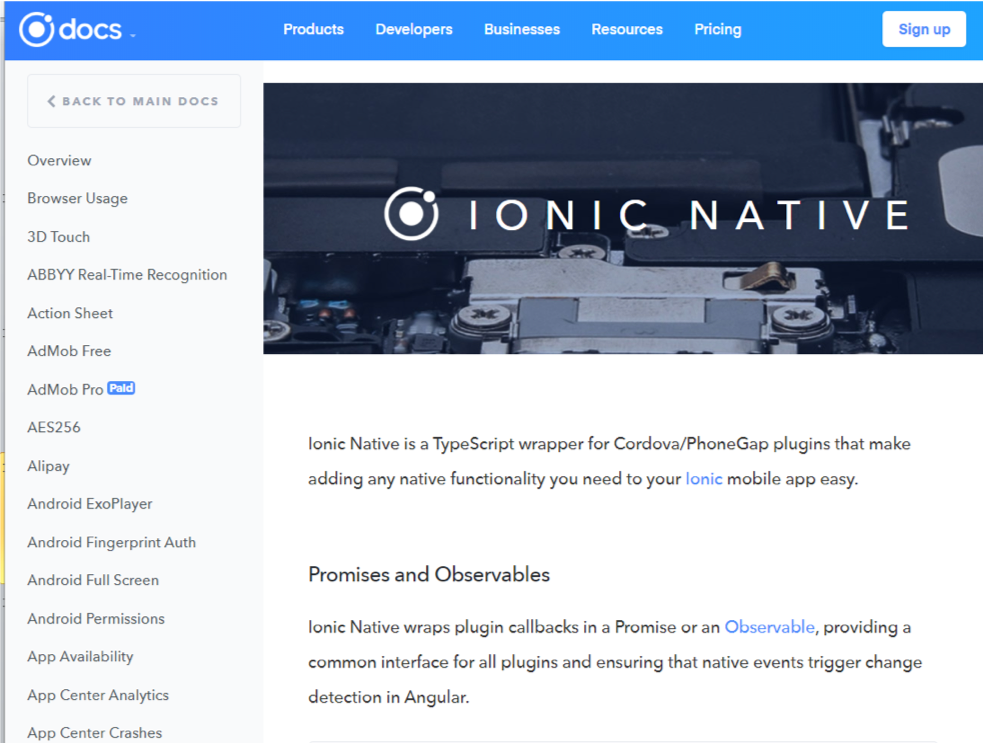

# 1.Table of Contents

* Introduction to Trinity
* Definition of DApp
* Setup Development Environment
* Create Dapp
* Run the Dapp
* Develop Ionic App
* Plugin for Trinity

## 2.Introduction to Trinity

* Trinity is a container that provides DApp running environment. Based on the trusted running environment of Elastos Runtime, Trinity provides a reliable running environment for applications to protect digital content 。
* Trinity make developers easy to develop their App by using Ionic frameworks.  Developers can create Elastos DApp package directly in the Ionic export directory. The created DApp can run on Android, IOS, Windows, Linux devices.
* Ionic is a powerful HTML5 application development framework (HTML5 Hybrid Mobile App Framework). The developers can use HTML, CSS and Javascript web develoment technique to create a near native App experiences. Ionic focus on outlook, users' experiences and interaction. It is most suitable for devlopment of HTML5 hybrid mobile App.
* Ionic is a lightweight UI library. It is responsive with modern and beautiful outlook.

### 2.1.Fetures of Trinity


### 2.2.Advantages of Trinity

* The Dapp run on the devices of users belong to them forever

* DApp does not rely on the centralized server

* the digital assets ownership are recorded in the Blockchain, the transactions are decentralized

* The DApp can be freely packaged and created by users

* Protect the digital assets. The assets owensership will not be disclosed abd destroyed

### 2.3.Trinity Architecture


## 3.Definition of DApp

There are two components in DApp: The DApp owenership and DApp document.

The ownership in DApp is in the Blockchain like the bitcoin in the personal wallet. The DApp cannot run if there is no ownership in the wallet. Of course the DApp can configure as free app. You can resell the DApp similar to  bitcoin if you play enough for the DApp games. Of course this you must pay for this transaction similar to token swap. This swap can be either centralized or decentralized.

There are various ways to dsirtribute teh DApp such as Yahoo Yellow page, diffeent App Store, Cloud drives to peer to peer.


## 4.Setup Development Environment


## 5.Create Dapp


## 6.Run the Dapp


### 6.1.Run Inside Trinity

* 1 Install Trinity
* 2 Use Ionic to comply a encrypted epk document

    https://github.com/elastos/Elastos.ORG.Wallet.Mobile/tree/ds/build

    ```
    ionic cordova build android --prod && node epk xxx
    ```

* 3 Copy or download to epk to the device
* 4 Import the epk document through Trinity, tehn run on the desktop

 


## 7.Develop Ionic App

### 7.1.UI Components

* Ionic apps are made of high-level building blocks called components. Components allow you to quickly construct an interface for your app. Ionic comes with a number of components, including modals, popups, and cards. Check out the examples below to see what each component looks like and to learn how to use each one. Once you’re familiar with the basics, head over to the API docs for ideas on how to customize each component.

### 7.2.Native APIs



## 8.Plugin for Trinity


