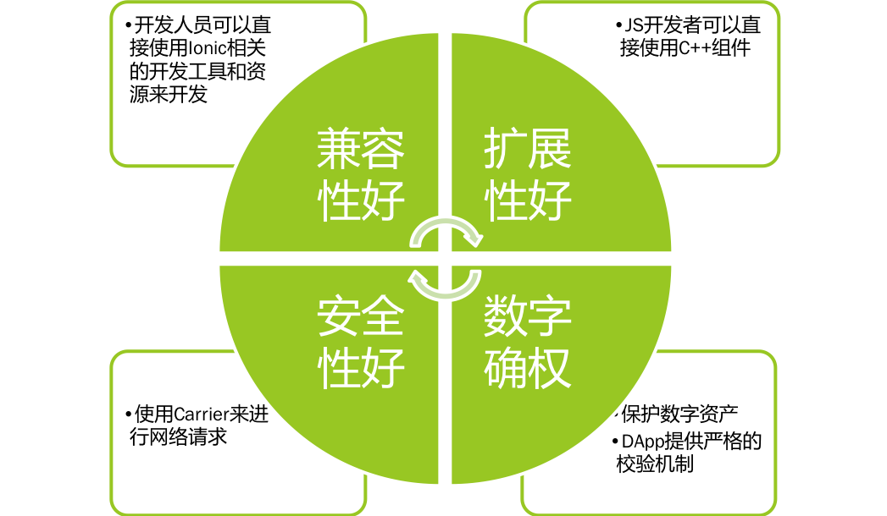
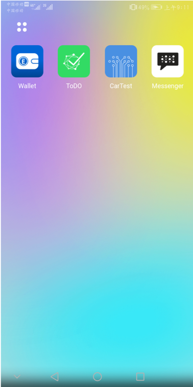
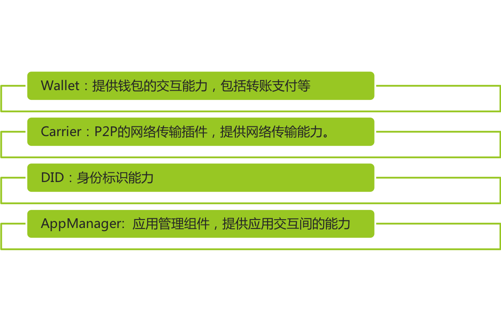

# 1.Table of Contents

* Introduction to Trinity
* Definition of DApp
* Setup Development Environment
* Create Dapp
* Run the Dapp
* Develop Ionic App
* Plugin for Trinity

## 2.Introduction to Trinity

* Trinity is a container that provides DApp running environment. Based on the trusted running environment of Elastos Runtime, Trinity provides a reliable running environment for applications to protect digital content 。
* Trinity为了便于应用开发者，采用兼容ionic开发框架来支持应用开发。应用开发者可用直接把基于ionic的输出目录下的文件来生成DApp的包. 同一个DApp可运行在Android, IOS, Windows, Linux等设备上。
* Ionic 是一个强大的 HTML5 应用程序开发框架(HTML5 Hybrid Mobile App Framework )。可以帮助您使用 Web 技术，比如 HTML、CSS 和 JavaScript 构建接近原生体验的移动应用程序。ionic 主要关注外观和体验，以及和你的应用程序的 UI 交互，特别适合用于基于 Hybird 模式的 HTML5 移动应用程序开发。
* Ionic是一个轻量的手机UI库，具有速度快，界面现代化、美观等特点。

### 2.1.Fetures of Trinity



### 2.2.Advantages of Trinity

* The Dapp run on the devices of users belong to them forever

* DApp does not rely on the centralized server

* the digital assets ownership are recorded in the Blockchain, the transactions are decentralized

* The DApp can be freely packaged and created by users

* Protect the digital assets. The assets owensership will not be disclosed abd destroyed

### 2.3.Trinity Architecture


## 3.Definition of DApp

There are two components in DApp: The DApp owenership and DApp document.

The ownership in Dapp is in the Blockchain like the bitcoin in the personal wallet. The DApp cannot run if there is no ownership in the wallet. Of course the DApp can configure as free app.You can resell the DApp as bitcoin if you play enough for the DApp games. Of course this you must pay for this transaction similar to token swap. This swap can be either centralized or decentralized.

There are various ways to dsirtribute teh DApp such as Yahoo Yellow page, diffeent App Store, Cloud drives to peer to peer.


## 4.Setup Development Environment


## 5.Create Dapp


## 6.Run the Dapp


### 6.1.Run Inside Trinity

* 1 Install Trinity
* 2 Use Ionic to comply a encrypted epk document

    https://github.com/elastos/Elastos.ORG.Wallet.Mobile/tree/ds/build

    ```
    ionic cordova build android --prod && node epk xxx
    ```

* 3 Copy or download to epk to the device
* 4 Import the epk document through Trinity, tehn run on the desktop

 


## 7.Develop Ionic App

### 7.1.UI Components

* Ionic apps are made of high-level building blocks called components. Components allow you to quickly construct an interface for your app. Ionic comes with a number of components, including modals, popups, and cards. Check out the examples below to see what each component looks like and to learn how to use each one. Once you’re familiar with the basics, head over to the API docs for ideas on how to customize each component.

### 7.2.Native APIs


## 8.Plugin for Trinity


