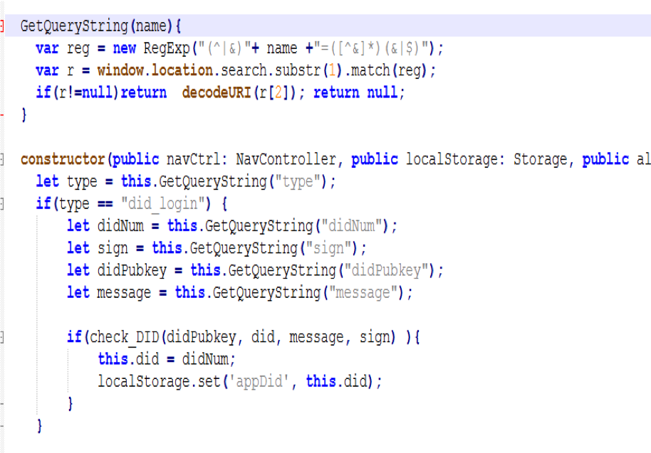
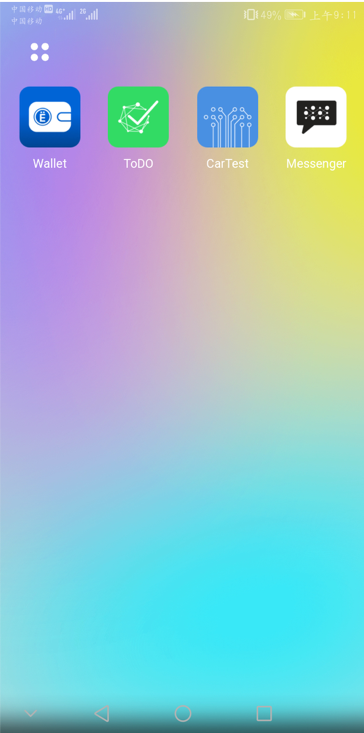
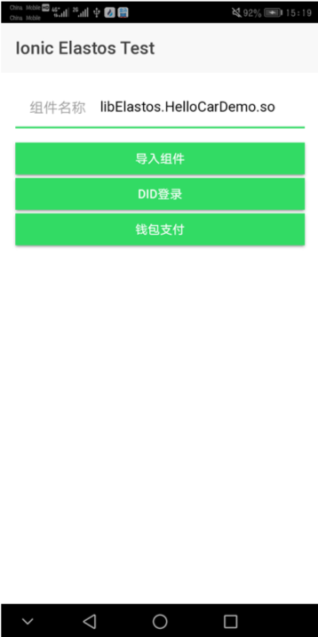

# 1.Introduction to DID

* DID is the identity of Blockchain similar to ID card of the real world
* Elastos DID centrally control the wallets

## 2. Explanation of Configuring the DID logon

### 2.1. Download and install the appmanager plugin

Plugin source path：

https://github.com/elastos/Elastos.ORG.Wallet.Mobile/tree/ds/appmanager

Installation instructions:

```
ionic cordova plugin add D:\project\Elastos.ORG.Wallet.Mobile\appmanager
```

### 2.2. Add the following code snippet to the page for DID logon

```
declare let cordova: any;
cordova.plugins.appmanager.StartApp("wallet/www/index.html" +
"?type=did_login&message=this is did login message&backurl=game/www/index.html",
function (data) {},
function (error) {});
```


## 3. Explanation of Input parameters

```
cordova.plugins.appmanager.StartApp("wallet/www/index.html" +
"?type=did_login&message=this is did login message&backurl=game/www/index.html",
function (data) {},
function (error) {});
```

* “wallet/www/index.html”：Root path of target DApp, the current path of wallet is wallet/www/index.html
* type: logon type, did_login is the current DID value
* message: use for encrypted verification
* backurl: the returned root path of the DApp after otaining the DID value

## 4. Explanation of Returned Parameters



* didNum: the number of DID，32 bytes string
* sign: teh signed message
* didPubkey: user's public key
* Message: input parameter for signing
* The authorization will be checked by function Check_DID, just put the following line in index.html

  ```
  <script src="assets/checkDID.js"></script>
  ```

* the checkDID.js file is in the following url
https://github.com/elastos/Elastos.ORG.Wallet.Mobile/tree/ds/build

## 5.Effect of Running in Trinity



